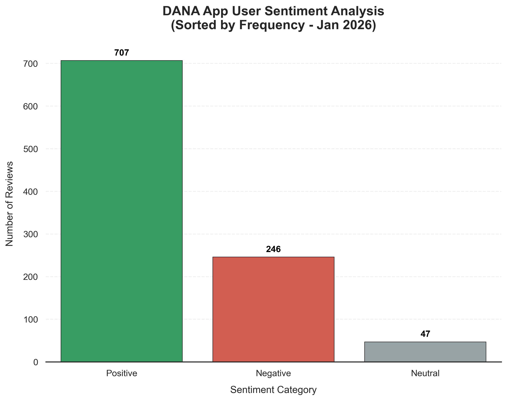
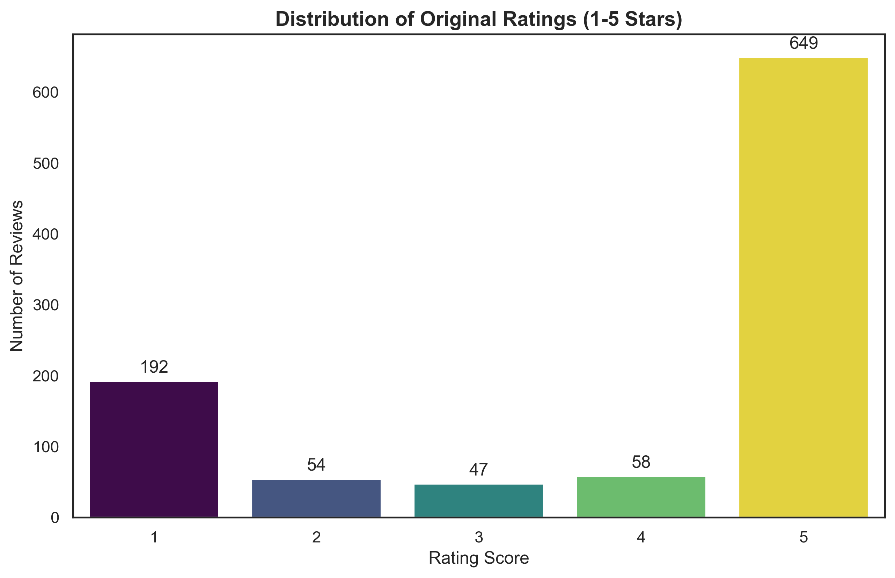
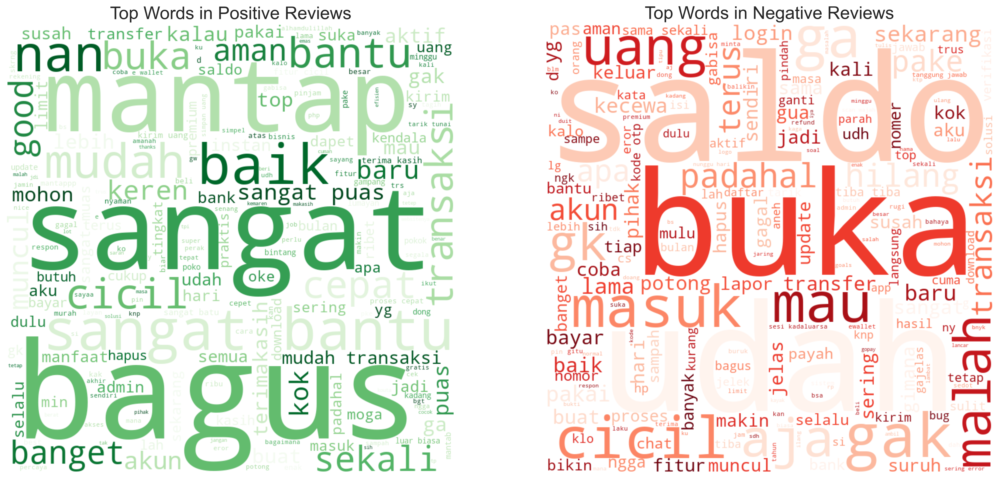
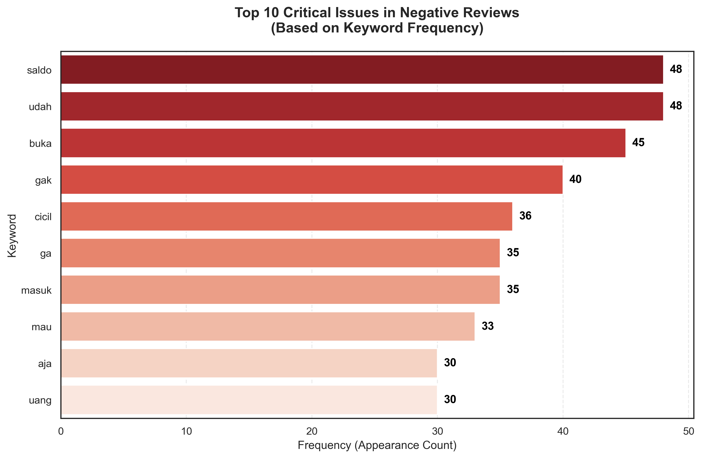

# 📊 Sentiment Analysis: DANA App Reviews (Jan 2026)

## 📌 Project Overview
This project performs an end-to-end sentiment analysis of the **DANA Digital Wallet** application reviews on the Google Play Store. The goal is to identify user pain points and provide actionable business recommendations based on 1,000 recent reviews collected in **January 2026**.

## 📁 Project Structure
- `data/`: Contains the raw scraped data and the cleaned dataset after preprocessing.
- `notebooks/`: 
  - `01_scraping.ipynb`: Data gathering using `google-play-scraper`.
  - `02_cleaning.ipynb`: Text preprocessing including slang normalization and Indonesian stemming using `Sastrawi`.
  - `03_analysis.ipynb`: Sentiment classification and advanced data visualization.
- `visualizations/`: Exported high-resolution charts for reporting.

## 🛠️ Techniques & Workflow
This project implements several Data Science and NLP techniques:
* **Web Scraping**: Dynamic data extraction from Google Play Store using `google-play-scraper`.
* **Natural Language Processing (NLP)**:
  * **Text Preprocessing**: Cleaning noise, lowercasing, and removing special characters.
  * **Slang Normalization**: Mapping informal Indonesian slang to formal language for better accuracy.
  * **Stopwords Removal**: Eliminating common and brand-specific words (e.g., "dana", "saya") to focus on sentiment-bearing terms.
  * **Indonesian Stemming**: Reducing words to their root form using the `Sastrawi` library.
* **Sentiment Analysis**: Rule-based classification to categorize reviews into Positive, Neutral, and Negative sentiments.
* **Data Visualization**: Exploratory Data Analysis (EDA) using `Seaborn` and `Matplotlib` to derive business-centric insights.

## 🔍 Key Insights

### 1. Sentiment & Rating Distribution
While the majority of users are highly satisfied (649 5-star reviews), there is a significant polarized group with 192 1-star reviews, indicating that when users face issues, they are often severe.

  
  

### 2. Word Cloud Comparison
- **Positive Sentiment**: Focused on keywords like "mantap", "bagus", and "cepat", reflecting high satisfaction with transaction speed and ease of use.
- **Negative Sentiment**: Dominated by "saldo", "buka", and "login", highlighting critical technical barriers.

  

### 3. Top 10 Critical Issues
Technical stability (app not opening) and financial trust (balance synchronization) are the most cited problems in negative feedback.

  

## 💡 Recommendations
1. **Fix Application Stability**: Priority #1 is resolving the "Login/Open" loop where users are unable to even access the application.
2. **Real-time Balance Sync**: Improve UI response times and transaction status notifications to reduce user anxiety regarding "pending" balances.
3. **Feature Transparency**: Manage expectations for "DANA Cicil" eligibility to reduce negative sentiment surrounding credit limits.

---
## 👩‍💻 Author
**Azizah Adilah** *Data Science Student at Institut Teknologi Sepuluh Nopember (ITS)* 

**Tech Stack:** Python 3.12.7, Pandas, Matplotlib, Seaborn, Sastrawi, WordCloud.

